# Grok AI图像生成器：怎么用它创造吉卜力风格艺术

---

从粉丝艺术到梦幻世界，Grok AI图像生成器正在把普通人变成数字艺术家。特别是吉卜力风格的趋势，现在火到哪都能看见。不过别着急——这篇文章会手把手教你怎么加入这波热潮，生成那些人们忍不住想转发的图片。不管你是想玩玩，还是想涨粉，我们都会告诉你怎么用Grok AI图像生成器，以及另一个更厉害的AI工具。

---

## 什么是Grok AI图像生成器

Grok AI是Elon Musk旗下xAI公司搞出来的图像生成工具，2024年12月正式上线。它基于Aurora模型——一个能同时处理文字和图像的多模态AI架构。简单说，你输入文字描述或者上传一张照片，它就能给你生成高质量、逼真的图像。

不过要注意，Grok AI目前只在X平台（就是以前的Twitter）上提供，而且你的账号得满足两个条件：账号年龄至少7天，手机号已验证。

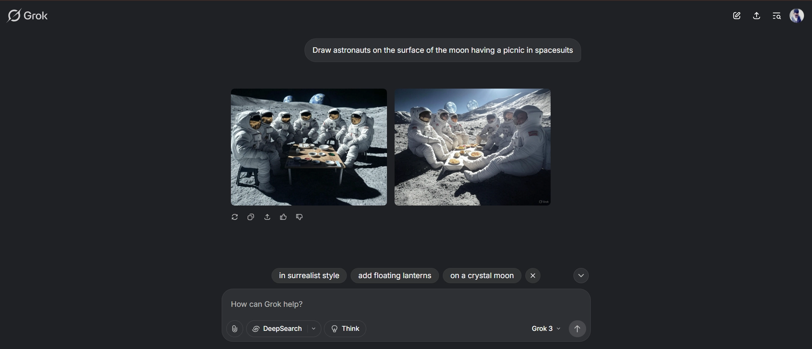

## 如何在X上使用Grok AI：分步指南

Grok AI给你两种创作方式。第一种，直接用文字描述生成全新图像；第二种，上传现有照片，让AI按你要的风格重新处理。不管哪种方式，几次点击就能搞定。

### 方法1：从文字提示创建图像

**步骤1：设置你的X账号**

首先确保你有个符合条件的X账号。如果还没有，去X官网注册一个。然后检查你的账号是否已经手机验证——进"设置"→"账户"→"账户信息"就能看到。记住，账号至少得用了7天才行。

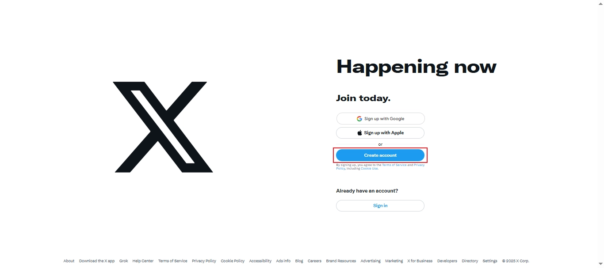

**步骤2：在X上访问Grok AI**

登录X账号后，点击左侧菜单里的"Grok"选项。或者更快的方法——点击底部搜索栏旁边的斜杠（/）图标，直接启动Grok。如果你用手机，也可以在App Store或Google Play下载Grok独立应用。

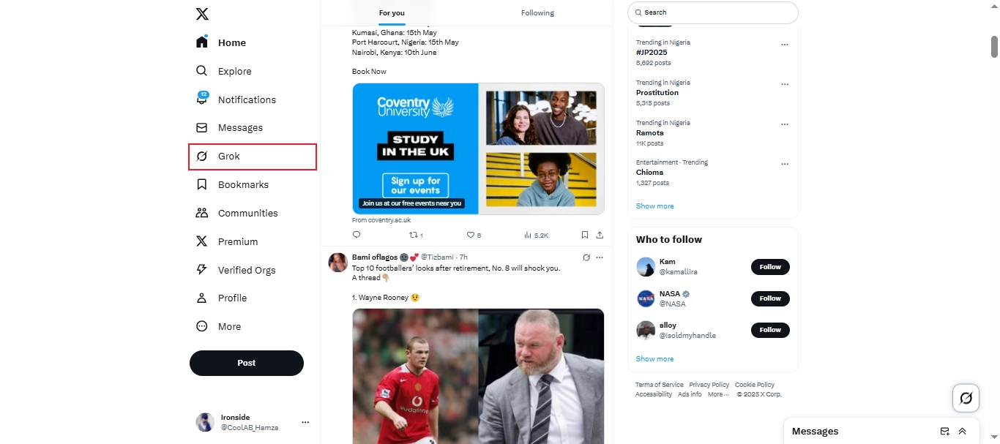

**步骤3：写个好提示词**

进入Grok后，点击"Grok 3 beta"，然后选择"试试grok.com"。在写提示词时，尽量具体描述你想要的主题、场景、风格和氛围。比如："夜晚超现实的赛博朋克城市景观，霓虹灯，雨天氛围，电影镜头角度。"

记住，生成的图像都是JPEG格式，分辨率1024 x 768像素。

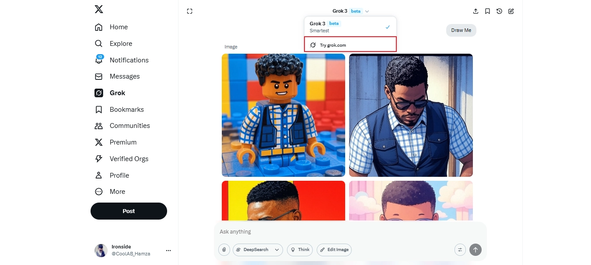

**步骤4：生成并保存图像**

输入提示词后，点击向上箭头图标"Enter"生成图像。系统会给你两个选项，选一个你喜欢的，点击底部的"保存"按钮下载到电脑。

不过有个问题——所有生成的图像都带Grok水印，这可能会限制你的商业用途。

### 方法2：将照片转换为吉卜力风格艺术

**步骤1：准备好照片**

登录X账号，选一张高质量的肖像照片。照片应该光线充足、自然均匀，能清楚看到面部特征。格式支持JPG或PNG，大小不超过10MB。记住，未经他人同意不要上传别人的照片。

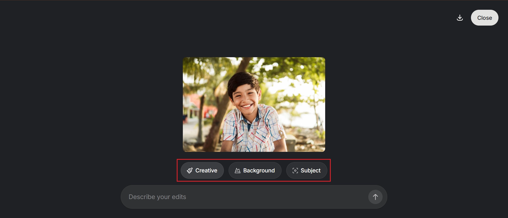

**步骤2：上传到Grok**

进入Grok界面，点击"编辑图像"，然后点"上传"把照片传上去。

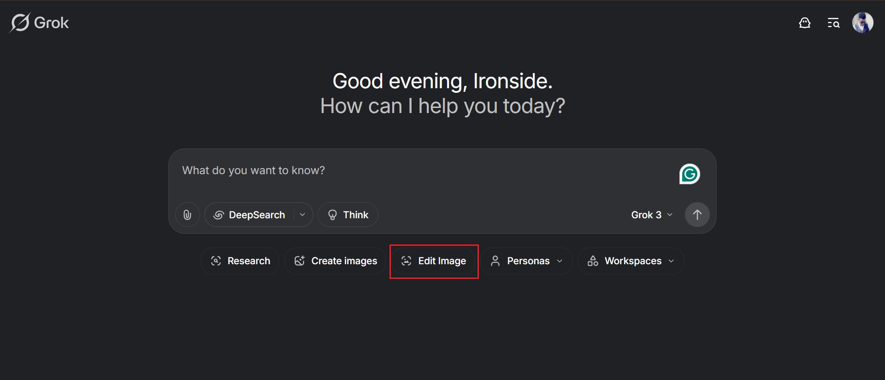

**步骤3：添加"吉卜力化"提示词**

上传照片后，输入提示词引导AI生成。记得在提示词中包含"吉卜力风格"。比如这样：

"生成一个穿格子衬衫的微笑男孩，在阳光明媚的森林空地上，柔和的阴影和郁郁葱葱的绿色植物，吉卜力动画风格，温暖而神奇的氛围。"

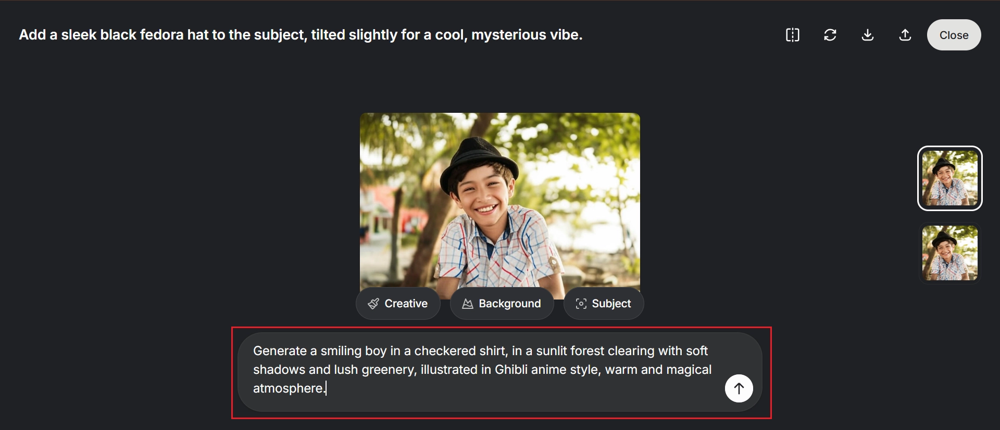

**步骤4：下载和分享**

生成后，从两张图像中选你最喜欢的，点击"导出"图标保存。你可以发到X上，或者通过邮件、其他社交媒体分享。

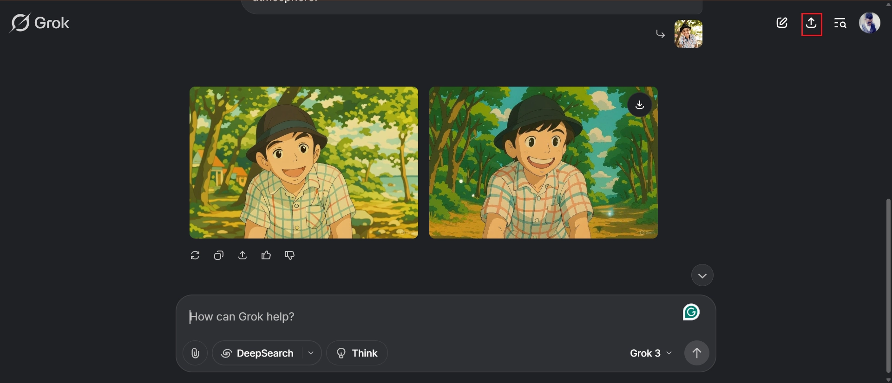

## Grok 2 AI图像生成器值得用吗

Grok 2因为整合在X平台上，用起来确实方便，图像质量也不错。但它到底怎么样？我们来看看优缺点。

**优点：**

- **免费访问**：只要你是X验证用户，完全免费使用，不需要另外下载或注册
- **逼真输出**：生成的图像质量高，纹理、光照和细节都处理得很到位
- **理解能力强**：能准确理解复杂的文字提示，生成的图像符合你的想法
- **社交分享方便**：生成后可以直接发布到X，不用下载再上传

**缺点：**

- **使用限制**：免费用户每2小时只能生成10张图片，对重度用户来说不够用
- **账号要求**：必须是验证账号且至少7天，新用户进不来
- **带水印**：所有图像都有Grok水印，影响专业和商业用途
- **编辑功能少**：没有修复、背景去除、图层编辑等高级功能

说实话，Grok 2在生成图像方面做得不错，但当你需要更多控制——比如调整生成的图像、获得更清晰的效果、或者在平台外自由使用设计时，它就开始显露局限了。👉 [想要更专业的AI图像生成体验？试试Grok Super会员一个月成品号（质保30天），解锁更多创作可能](https://shaoyumi.com/buy/66)

## 介绍Dreamina：Grok 2.0的强大替代选项

Dreamina使用先进的AI技术，能把简单的文字提示和图像转换成个性化的视觉效果。它的AI图像生成器会根据你的输入解释细节、样式和主题，让你始终掌控创作过程。不仅如此，它还有修复和HD放大功能，让你能修改或提高图像分辨率，最终得到精美的设计。

凭借这些AI能力，Dreamina成为一个多功能工具——你可以用它搭建宣传平台、开展广告活动、推出新产品，还能做更多事情。

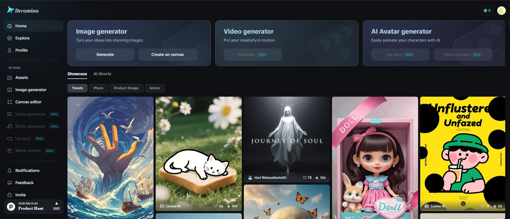

### 使用Dreamina创建图像的步骤

进入Dreamina主页后，前往图像生成器选项卡并点击"生成"。这会带你到另一个界面，在文本框中输入提示词。比如这样：

"前景是郁郁葱葱的绿色草地，背景是高耸的山脉，充满活力的日落在场景中投射出金色光芒。"

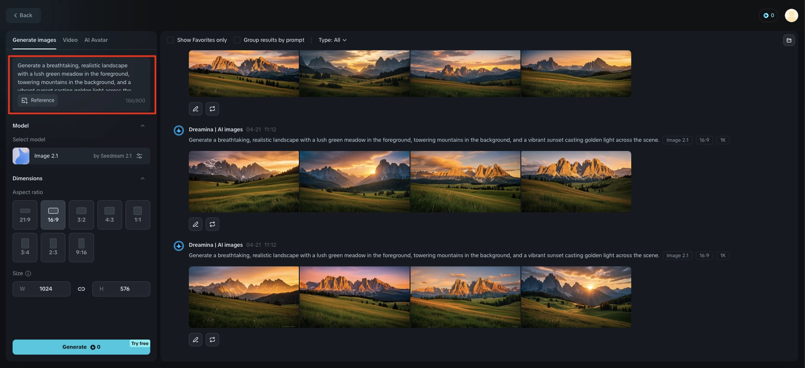

如果你想根据自己的照片生成新照片，点击"参考"从电脑上传图像，选择你希望AI参考的那张，点击"保存"。记得输入文字提示来引导AI。

比如："将此头像转换为具有粗犷特征的逼真西部牛仔。牛仔应该戴宽边牛仔帽，脖子上系着满是灰尘的头巾，穿经典牛仔衬衫或背心。他应该有坚强、饱经风霜的表情，带着自信而坚韧的神情。"

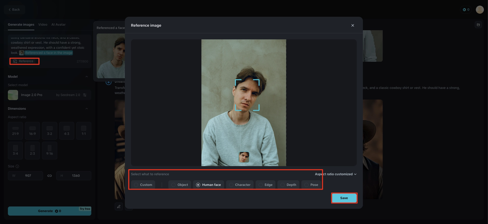

之后，点击"模型"选择你喜欢的模型。然后选择最适合你用途的"纵横比"——不管是用于展示还是社交媒体帖子。如果你想要自定义尺寸，在"尺寸"下输入。完成后，点击"生成"创建图像。

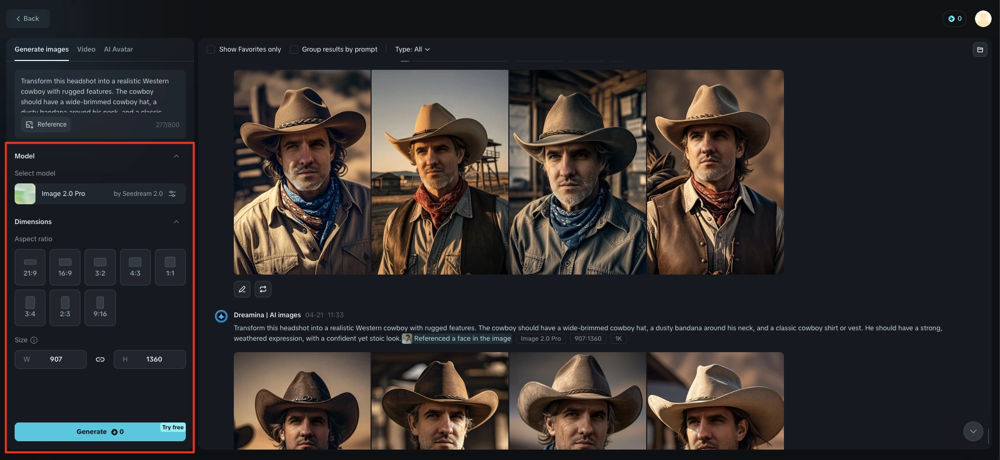

生成后，从四个选项中选你最喜欢的设计，点击"下载"保存到电脑。

### Dreamina的其他高级AI工具

**1. AI修复**

Dreamina的修复工具让你能精确地添加或修改图像。刷过你要更改的区域，输入描述所需内容的简短提示，AI会智能地填充或替换那部分以匹配周围元素。你可以用这个工具快速无缝地进行复杂编辑，比如修复损坏点或增强细节。

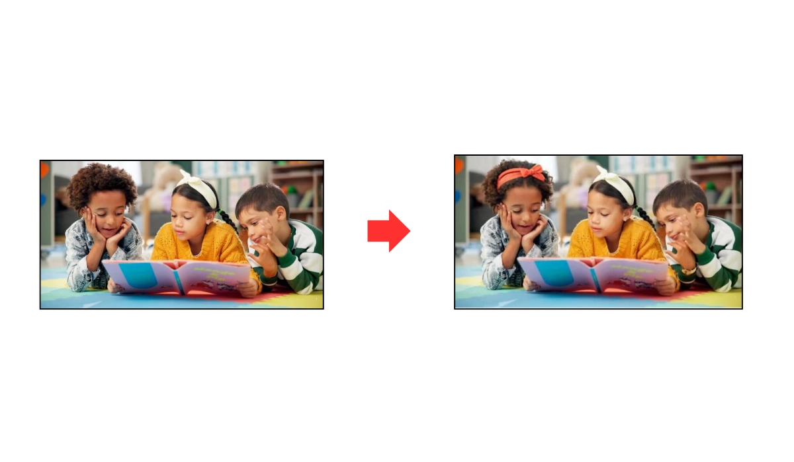

**2. 移除工具**

图像中有些不想要的物体或元素？Dreamina的移除工具能从图像中删除不需要的元素，而不会破坏原始构图。该工具准确删除物体，不会在图像上留下任何痕迹。对于快速编辑来说非常方便，无需从头开始。

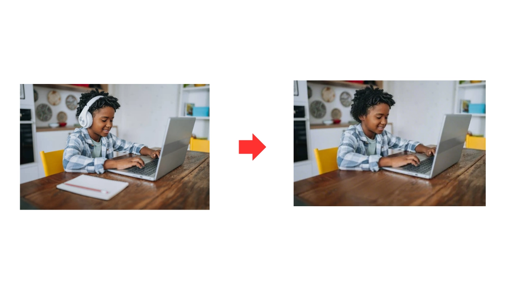

**3. HD放大**

Dreamina的HD放大工具让你能在不损失质量的情况下提高图像分辨率。它使用先进的AI技术增强图像细节、锐化边缘和减少模糊，让个人头像、风景照和日常快照看起来更清晰。处理低分辨率照片或准备打印设计时，这个工具能帮你只需几次点击就获得高清效果。

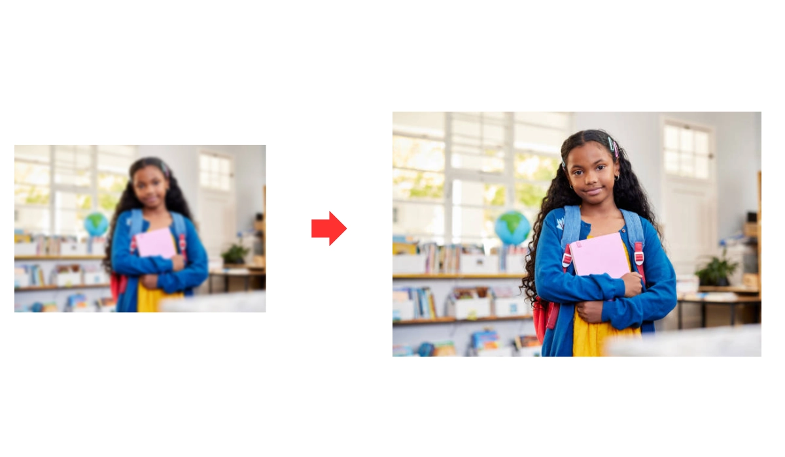

**4. 魔法扩展**

Dreamina的扩展工具让你能扩展图像边界，同时保持原始样式、颜色和视觉连贯性。使用AI，它能智能生成与现有设计无缝融合的新内容，非常适合重新构图、调整纵横比或为文字和其他元素创造更多空间，而不会扭曲核心图像。

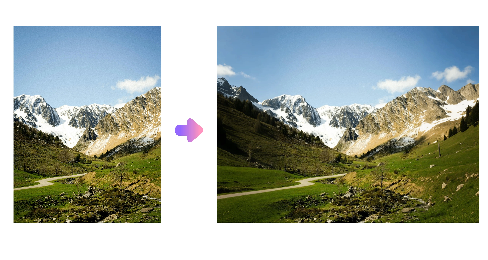

**5. AI混合**

Dreamina的混合工具让你能通过将两个图像的视觉元素合并到单一、有凝聚力的设计中来组合它们。它使用先进的AI分析两个图像的纹理、颜色和光照，确保自然无缝的过渡。这对于创建艺术构图、将照片上传到身份证或概念视觉效果非常有用，其中两个想法或场景需要在视觉上融合为一个。

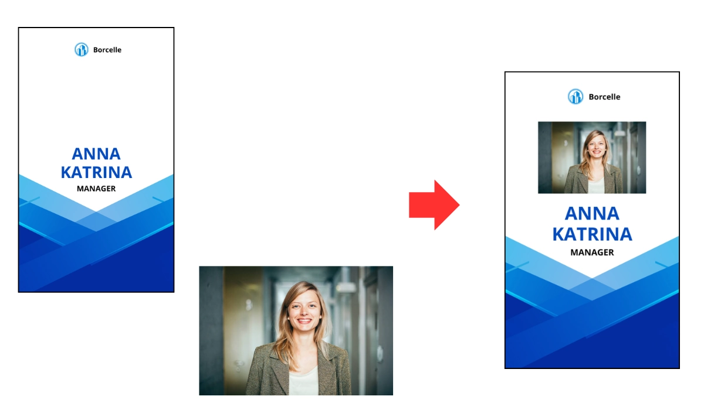

---

Grok AI图像生成器对于想直接在X上体验AI生成艺术的人来说是个不错的起点。它简单易用，适合休闲创作。但如果你想要更多创意控制、更高质量输出和真正可定制的设计体验，Dreamina是更好的选择。使用Dreamina，你能获得更多功能、更多灵活性，以及更好的控制力来决定图像的外观、感觉和讲述你的故事方式。准备好让视觉效果走向专业了吗？👉 [立即体验Grok Super会员一个月成品号（质保30天），用专业工具释放你的创意潜力](https://shaoyumi.com/buy/66)
